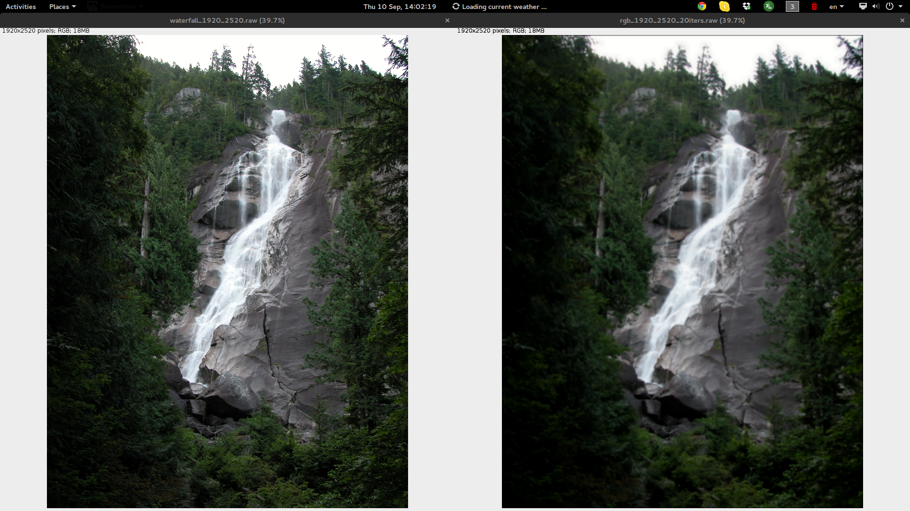
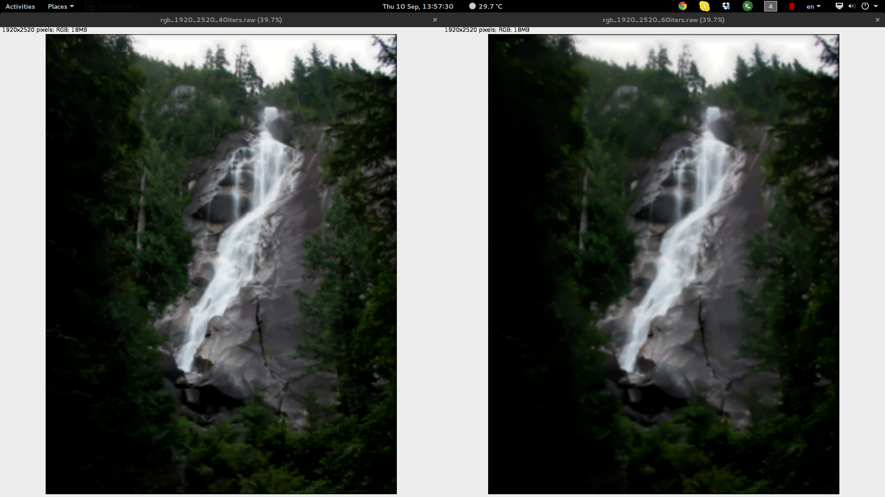
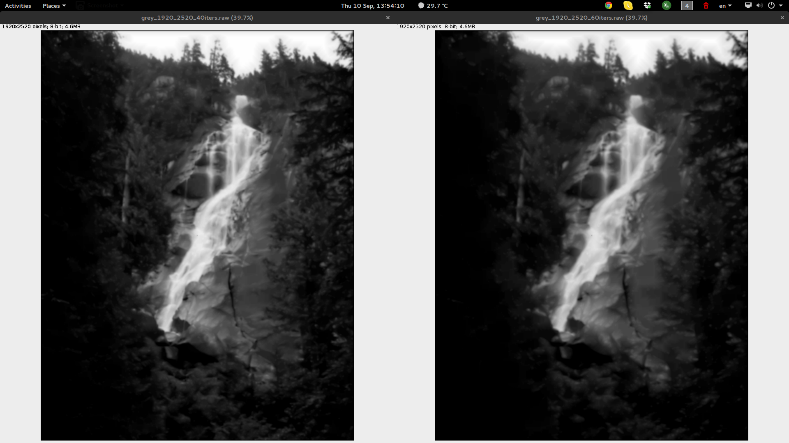

# Parallel Convolution [![License MIT][badge-license]](LICENSE.txt)

### MPI - MPI & OpenMP - CUDA

Image-filtering program optimized with Parallel Programming techniques

A parallel program to apply convolution filters to images. Written in C, optimized in three different ways: MPI, MPI & OMP and CUDA. 

#### Examples

[badge-license]: https://img.shields.io/badge/license-MIT-green.svg?style=flat-square
